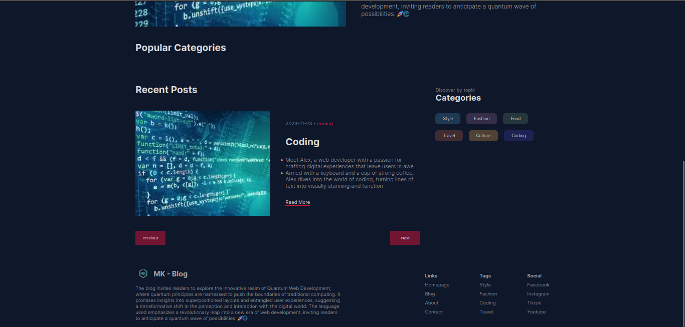

# NEXT Blog Using Firebase & Mongodb Inspired By Lama Dev

## Project Screenshots

### Login


### Home


###  Post Dark


### Post Light


### Blog Dark


### Comments


## 1.Folder Structure 
```bash
├── app
│   ├── api
│   │   ├── auth
│   │   │   └── [...nextauth]
│   │   │       └── route.js
│   │   ├── categories
│   │   │   └── route.js
│   │   ├── comments
│   │   │   └── route.js
│   │   └── posts
│   │       ├── route.js
│   │       └── [slug]
│   │           └── route.js
│   ├── blog
│   │   ├── blogPage.module.css
│   │   └── page.jsx
│   ├── favicon.ico
│   ├── globals.css
│   ├── homepage.module.css
│   ├── layout.js
│   ├── login
│   │   ├── loginPage.module.css
│   │   └── page.jsx
│   ├── page.jsx
│   ├── posts
│   │   └── [slug]
│   │       ├── page.jsx
│   │       └── singlePage.module.css
│   └── write
│       ├── page.jsx
│       └── writePage.module.css
├── components
│   ├── authLinks
│   │   ├── AuthLinks.jsx
│   │   └── authLinks.module.css
│   ├── card
│   │   ├── Card.jsx
│   │   └── card.module.css
│   ├── cardList
│   │   ├── CardList.jsx
│   │   └── cardList.module.css
│   ├── categoryList
│   │   ├── CategoryList.jsx
│   │   └── categoryList.module.css
│   ├── comments
│   │   ├── Comments.jsx
│   │   └── comments.module.css
│   ├── featured
│   │   ├── Featured.jsx
│   │   └── featured.module.css
│   ├── footer
│   │   ├── Footer.jsx
│   │   └── footer.module.css
│   ├── Menu
│   │   ├── Menu.jsx
│   │   └── menu.module.css
│   ├── menuCategories
│   │   ├── MenuCategories.jsx
│   │   └── menuCategories.module.css
│   ├── menuPosts
│   │   ├── MenuPosts.jsx
│   │   └── menuPosts.module.css
│   ├── navbar
│   │   ├── Navbar.jsx
│   │   └── navbar.module.css
│   ├── pagination
│   │   ├── Pagination.jsx
│   │   └── pagination.module.css
│   └── themeToggle
│       ├── ThemeToggle.jsx
│       └── themeToggle.module.css
├── context
│   └── ThemeContext.jsx
├── providers
│   ├── AuthProvider.jsx
│   └── ThemeProvider.jsx
└── utils
    ├── auth.js
    ├── connect.js
    └── firebase.js
```
## 1.Setup & Installation

This is a [Next.js](https://nextjs.org/) project bootstrapped with [`create-next-app`](https://github.com/vercel/next.js/tree/canary/packages/create-next-app).

## Getting Started

First, run the development server:

```bash
npm run dev
# or
yarn dev
# or
pnpm dev
```

Open [http://localhost:3000](http://localhost:3000) with your browser to see the result.

You can start editing the page by modifying `app/page.js`. The page auto-updates as you edit the file.

This project uses [`next/font`](https://nextjs.org/docs/basic-features/font-optimization) to automatically optimize and load Inter, a custom Google Font.

## 2.Database Setup

1. **Create a MongoDB Atlas Account:**
   - Go to the [MongoDB Atlas website](https://www.mongodb.com/cloud/atlas).
   - Click on the "Start Free" button and follow the steps to create an account.

2. **Create a New Cluster:**
   - Once logged in, click on the "Build a Cluster" button.
   - Choose the provider and region for your cluster.
   - Configure the cluster settings as needed.
   - Click on the "Create Cluster" button.

3. **Configure Security Settings:**
   - In the left-hand menu, click on "Database Access" under the "Security" section.
   - Click on the "Add a Database User" button and create a new user with a secure password.

4. **Whitelist IP Address:**
   - Still in the "Security" section, click on "Network Access."
   - Add your current IP address to the IP Whitelist. This ensures that your application can connect to the cluster.

5. **Get Connection String:**
   - In the left-hand menu, click on "Clusters" to go back to the main cluster view.
   - Click on the "Connect" button for your cluster.
   - Choose "Connect your application."
   - Copy the connection string. It will look something like this (with placeholders for your username, password, and database name):

     ```plaintext
     mongodb+srv://<username>:<password>@cluster0.mongodb.net/<database>
     ```

   - Replace `<username>`, `<password>`, and `<database>` with your actual database credentials.
## 3.Setting Up Firebase

This project utilizes Firebase services for various functionalities. To get started with Firebase, please follow the steps below:

1. **Create a Firebase Project:**
   - Visit the [Firebase Console](https://console.firebase.google.com/).
   - Click on "Add Project" and follow the setup instructions.

2. **Set Up Firebase Config:**
   - Obtain your Firebase configuration by navigating to Project Settings > General > Your Apps > Firebase SDK snippet.
   - Copy the configuration details.

3. **Configure the Project:**
   - Create a `.env` file in the project root.
   - Paste the Firebase configuration into the `.env` file.

    ```dotenv
    NEXT_APP_FIREBASE_API_KEY=<your-api-key>
    NEXT_APP_FIREBASE_AUTH_DOMAIN=<your-auth-domain>
    NEXT_APP_FIREBASE_PROJECT_ID=<your-project-id>
    NEXT_APP_FIREBASE_STORAGE_BUCKET=<your-storage-bucket>
    NEXT_APP_FIREBASE_MESSAGING_SENDER_ID=<your-messaging-sender-id>
    NEXT_APP_FIREBASE_APP_ID=<your-app-id>
    ```

4. **Install Firebase :**
   ```bash
   npm install firebase
   ```
## 4.Initializing Firebase

1. Create a new file named `firebase.js` within the `src/utils` directory.

2. Insert the Firebase configuration code, as prescribed in the official Firebase documentation. This configuration code is pivotal for seamless interaction between your application and Firebase services.

    ```js
    import { initializeApp } from "firebase/app";
    import { getAuth } from "firebase/auth";
    import { getStorage } from "firebase/storage";
    import { getFirestore } from "firebase/firestore";


    const firebaseConfig = {
    apiKey: process.env.NEXT_APP_FIREBASE_API_KEY
    authDomain: process.env.NEXT_APP_FIREBASE_AUTH_DOMAIN
    projectId: process.env.NEXT_APP_FIREBASE_PROJECT_ID
    storageBucket: process.env.NEXT_APP_FIREBASE_STORAGE_BUCKET
    messagingSenderId: process.env.NEXT_APP_FIREBASE_MESSAGING_SENDER_ID
    appId: process.env.NEXT_APP_FIREBASE_APP_ID
    };

    export const app = initializeApp(firebaseConfig);
    export const auth = getAuth();
    export const storage = getStorage();
    export const db = getFirestore();

    ```
## 5.Activating & Setting Up Firebase(Storage)

To activate Firebase Storage for your project, follow these steps:
1. **Go to the Firebase Console:**
- Visit [Firebase Console](https://console.firebase.google.com/).
2. **Select Your Project:**
- If you have multiple projects, select the project you are working on.
3. **Navigate to Storage:**
- In the left-hand menu, click on "Storage." This will take you to the Firebase Storage section.
4. **Set Up Storage:**
- If it's your first time setting up Firebase Storage for the project, you will be prompted to get started. Click on the "Get Started" button.
5. **Choose a Location:**
- Select the location where you want to store your data. This choice can impact data latency and compliance with regional data regulations.
Certainly! If you want to instruct users to replace the default storage rules with specific rules, you can phrase it like this:

"6. **Update Storage Rules:**
   - Replace the default rules in the Firebase Console (while in Storage go to rules) with the following rules.
```js
rules_version = '2';
service firebase.storage {
  match /b/{bucket}/o {
    match /{allPaths=**} {
      // Customize these rules based on your security requirements
      // Allow or restrict read and write access as needed
      allow read, write;
    }
  }
}
```
7. **Complete the Setup:**
- Follow any additional prompts or instructions to complete the Firebase Storage setup.
8. **Integrate with Your Project:**
- Now that Firebase Storage is set up, you can start integrating it into your project. Obtain the necessary configuration details, such as the storage bucket URL, for use in your application.

## 6.Running The Application

To run the application locally, follow these steps:

1. **Install Dependencies:**
   ```bash
   npm install
   ```

2. **Start the Development Server:**
   ```bash
   npm run start
   ```

3. **View the Application:**
   - Open your browser and navigate to [http://localhost:3000](http://localhost:3000).
   - The application should be live and accessible for development and testing.
---
## 7.Open the `.env` file in a text editor and add the following lines:
```bash
NODE_ENV= development
```
### Mongodb Atlas URL
```bash
DATABASE_URL=""
```
### Googgle OAuth
```bash
GOOGLE_CLIENT_ID= 
GOOGLE_CLIENT_SECRET=
```
### Github OAuth
```bash
# optional
# GITHUB_ID=
# GITHUB_SECRET=
```
### FireBase
```bash
NEXT_APP_FIREBASE_API_KEY=<your-api-key>
NEXT_APP_FIREBASE_AUTH_DOMAIN=<your-auth-domain>
NEXT_APP_FIREBASE_PROJECT_ID=<your-project-id>
NEXT_APP_FIREBASE_STORAGE_BUCKET=<your-storage-bucket>
NEXT_APP_FIREBASE_MESSAGING_SENDER_ID=<your-messaging-sender-id>
NEXT_APP_FIREBASE_APP_ID=<your-app-id>
```
### NextAuth Config
```bash
NEXTAUTH_URL=http://localhost:3000
NEXTAUTH_SECRET=generate_a_secret
```

